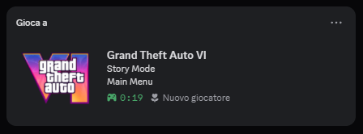

<p align="center">
  
</p>

<h1 align="center">GTA 6 Fake Discord Status Simulator (GTA VI)</h1>

<p align="center">
  A free, open-source Windows app for a realistic GTA 6 fake Discord game status: native game detection,
  or custom Rich Presence with rotating scenes, editable text, timers, and saved profiles.
</p>

<p align="center"><strong>Created by Cyberpino (@mamt104 on GitHub).</strong></p>

<p align="center">
  <a href="https://github.com/mamt104/gta6-discord-status-simulator/releases/latest"></a>
  <a href="https://github.com/mamt104/gta6-discord-status-simulator/blob/main/LICENSE"></a>
  
  
</p>

<p align="center">
  <a href="#quick-start">Quick start</a> ·
  <a href="#choose-your-mode">Modes</a> ·
  <a href="#build-from-source">Build</a> ·
  <a href="#troubleshooting">Troubleshooting</a> ·
  <a href="#privacy-and-security">Security</a> ·
  <a href="https://github.com/mamt104/gta6-discord-status-simulator/discussions/1">Feedback</a>
</p>

> [!IMPORTANT]
> This is an unofficial fan-made utility. It is not affiliated with, endorsed by, or sponsored by Rockstar Games, Take-Two Interactive, or Discord. It does not include GTA VI and is not evidence of access to a game build.

## Version 1.3.3 — Realistic Auto Resume

The Windows build and public source use the same tested implementation. This release fixes automatic first-time setup and makes scene rotation behave like a continuous play session instead of a random status picker.

- a newly applied Application ID defaults to **Realistic Auto (Resume)**, **Automatic**, suggested activity, empty custom text, and variable timing;
- a new automatic session starts in **Story Mode**, never at a randomly selected scene or Main Menu;
- pressing **SET STATUS** repeatedly refreshes the same scene; only the timer or **NEXT SCENE** advances it;
- closing and reopening the app resumes the last automatic scene before continuing the sequence;
- early solo activities lead into shared Jason and Lucia scenes, with longer variable durations and occasional natural repeats;
- the setup guide now warns that newly created Discord apps and images may take a few minutes to synchronize.

## GTA 6 fake Discord status, without game files

This GitHub project is made for anyone looking for a **GTA 6 fake Discord status**, a **GTA VI Rich Presence prank**, or a customizable fake game activity for Discord. It only changes the activity shown by Discord: it does not download, emulate, unlock, or include GTA VI.

## Why it feels like a real Discord game

| What you see immediately | How it works |
| --- | --- |
| **Clickable game page** | In **Discord detection only** mode, Discord can match the running `GTA6.exe` to its own Game Profile. When that match is available, clicking the game title opens Discord's game page instead of a custom website. |
| **Native, realistic presentation** | Discord renders the normal game card, icon, elapsed timer, hover behavior, profile link, and recent activity. The result looks like an ordinary detected game because this mode uses Discord's executable detection rather than a custom card. |

Discord controls the Game Profile match on its servers. The app cannot force or guarantee the official page on every account, Discord version, executable path, or cache state; registering the running EXE exactly as shown in [Quick start](#quick-start) gives Discord the information it needs.

## Proof: shown inside Discord

<p align="center">
  
</p>

This screenshot shows the project running as a Discord activity. Small visual differences can occur between accounts and client versions because Discord controls the final layout and icon cache.

## What you can customize

The app can appear in Discord through normal executable detection or send a custom Rich Presence through your own Discord Application ID. It is designed for convincing presentation while keeping setup local, transparent, and reversible.

| Highlight | What you get |
| --- | --- |
| Natural Discord detection | Discord controls the game card, hover behavior, Game Profile link, and recent activity |
| Session director | Ordered or manual activities with realistic timing and automatic resume |
| Flexible rotation | Variable timing or fixed 1, 3, 5, 10, 15, or 30-minute intervals |
| Character selection | Jason, Lucia, or combined play sessions |
| Clean startup | Optional five-minute period without a description |
| Personal control | Custom status text and an optional activity button with editable label and URL |
| Persistent settings | Your custom choices are saved; every launch starts safely in native Discord detection |
| Minimal access | No Bot Token, Client Secret, Discord password, or administrator rights required |

## Customizable session director

The desktop menu lets each user build a session without editing code:

- choose **Realistic Auto (Resume)** for an ordered sequence with natural scene lengths that restores its last scene after relaunch, or switch to a manual activity;
- filter the sequence for **Jason Duval**, **Lucia Caminos**, both characters, or automatic selection;
- rotate scenes at realistic variable times or every **1, 3, 5, 10, 15, or 30 minutes**;
- pick a suggested activity, skip to the next scene, or write a completely custom status;
- optionally start with no description for five minutes and enable or disable the custom activity button;
- use **SET** to edit the activity button label and URL, or restore the `Join` default with **RESET DEFAULTS**;
- keep preferences and the latest automatic scene in the local saved profile so they are restored on the next launch.

The automatic sequence is a plausible session arc inspired by Rockstar's publicly released character and location information. It is not a leaked or claimed mission order.

These controls belong to **Custom Rich Presence** mode. Leave **Discord detection only** enabled when the detected Discord Game Profile, clickable title, and recent activity are more important than custom text.

## Quick start

### 1. Download and extract

Download the latest package from [Releases](https://github.com/mamt104/gta6-discord-status-simulator/releases/latest), extract the entire ZIP, and keep all included files together.

### 2. Launch the fixed executable

Run `GTA6.exe`. Do not rename or move it after registration.

### 3. Register it in Discord

With the program still running:

1. Open **Discord → User Settings → Registered Games**.
2. Select **Add it!**.
3. Choose the running `GTA6.exe`.
4. Leave **Discord detection only** enabled in the app.

This registration step is required. Without it, Discord may display the wrong name or icon, skip recent activity, or treat renamed builds as different games.

> [!TIP]
> If you move the extracted folder later, remove the old Registered Games entry and add the executable again from its new path.

## Choose your mode

| | Discord detection only | Custom Rich Presence |
| --- | --- | --- |
| Best for | The most natural Discord game card | Custom scenes, state text, timer, and button |
| Setup | Add `GTA6.exe` to Registered Games | Create a Discord application and enter its Application ID |
| Card and icon | Managed by Discord | Managed by your Discord application and Art Assets |
| Recent activity | Controlled by Discord | Not guaranteed |
| Custom rotating details | No | Yes |
| Click and hover behavior | Controlled by Discord Game Profiles | Controlled by Discord Rich Presence |

**Discord detection only** starts automatically on every launch and sends no custom RPC payload. It is the recommended mode when the detected Game Profile is your priority.

**Custom Rich Presence** replaces the detected card. Discord can underline or make the complete `name + details + state` block clickable; the RPC protocol does not expose a setting that limits the clickable area to the game name.

The custom activity button is shown to other Discord users, not on your own profile. Its default label is `Join` and its default destination is Rockstar's official GTA VI pre-order page. Both values can be changed or reset inside the app.

## Custom Rich Presence setup

Skip this section if you only want Discord detection.

### Create your Discord application

1. Open the [Discord Developer Portal](https://discord.com/developers/applications).
2. Select **New Application** and name it `Grand Theft Auto VI`.
3. Under **General Information**, upload the included `gtavi_cover.png` as the **App Icon**, then save.
4. On the same page, copy the **Application ID**.
5. Do not use your Discord user ID; it is a different value. You do not need to create a bot.

### Add an image asset

1. Open **Rich Presence → Art Assets** in your application.
2. Upload the same `gtavi_cover.png` file from the release package (source builds create it under `dist`).
3. Name the uploaded resource `gtavi_cover` before saving it. Discord's technical documentation may call this resource name an **asset key**.
4. Save the asset and allow Discord a few minutes to update its cache.

The first synchronization of a newly created application can take a few minutes. Keep Discord open, wait briefly, and press **SET STATUS** again if the card or image has not appeared yet. Repeated presses refresh the current automatic scene and do not randomize it.

Discord does not let you rename a saved resource. Delete and upload the image again if its name is wrong. The included cover is unofficial fan artwork; replace it with your own square image if preferred.

### Save the Application ID

The easiest option is to disable **Discord game detection**, paste the Application ID into the app, and select **APPLY ID**. The value is saved locally beside the executable and can be changed later.

Alternatively, from PowerShell in the project folder:

```powershell
powershell -ExecutionPolicy Bypass -File .\configure.ps1
```

To use a different image key:

```powershell
.\configure.ps1 -AssetKey "my_cover"
```

The script creates local configuration under `dist`. Application IDs are public identifiers, but Bot Tokens, Client Secrets, OAuth tokens, passwords, and webhooks must never be pasted into the app or committed.

## Build from source

Requirements:

- Windows 10 or Windows 11;
- Discord desktop running on the same computer;
- Microsoft .NET Framework 4.x.

Build with the C# compiler included in .NET Framework:

```powershell
powershell -ExecutionPolicy Bypass -File .\build.ps1
```

The fixed-name executable is written to `dist\GTA6.exe`. For a clean rebuild:

```powershell
powershell -ExecutionPolicy Bypass -File .\build.ps1 -Clean
```

Run it with:

```powershell
.\run.ps1
```

The included `assets\app-icon.png` is embedded as the Windows executable icon. You may replace it with another authorized square PNG before rebuilding.

## Troubleshooting

<details>
<summary><strong>Discord does not show the game</strong></summary>

- Confirm the Discord desktop app is open.
- Run `GTA6.exe` before opening Registered Games.
- Add the exact running executable with **Add it!**.
- Keep **Discord detection only** enabled.
- Remove stale entries for renamed or older builds.
- Restart Discord after changing the registered path.

</details>

<details>
<summary><strong>The whole text block is underlined on hover</strong></summary>

That is Discord's custom Rich Presence presentation. Re-enable **Discord detection only** for pure executable detection. The app cannot override Discord's clickable area.

</details>

<details>
<summary><strong>The Rich Presence image does not appear</strong></summary>

- Confirm that `dist\gta6-image.txt` exactly matches the Developer Portal asset key.
- Allow a few minutes for Discord's image cache to update.
- Fully quit and reopen Discord.
- Delete and re-upload the Art Asset if you previously tried to rename its key.

</details>

<details>
<summary><strong>Buttons do not appear on my own profile</strong></summary>

Discord may hide an activity's URL buttons from its owner. Check the presence from a second account or ask a friend.

</details>

## Privacy and security

This is a desktop app, not a Discord bot. It talks only to the local Discord client through Rich Presence IPC, does not collect account passwords, and does not require administrator access.

Application IDs and Public Keys are public identifiers. Bot Tokens, Client Secrets, OAuth tokens, webhooks, Discord passwords, and session tokens are private credentials and are never required by this project. Never add them to configuration files or commits.

## Contributing

Questions and first-run feedback are welcome in [Discussion #1](https://github.com/mamt104/gta6-discord-status-simulator/discussions/1). Use [Issues](https://github.com/mamt104/gta6-discord-status-simulator/issues) for reproducible bugs, and pull requests for UI improvements, documentation, or new activity sequences. Please keep submissions free of personal configuration and unlicensed artwork.

If the project helped you, starring the repository makes it easier for other people to discover it.

## Credits

Created by **Cyberpino** (**@mamt104 on GitHub**), with feedback and testing from the open-source community.

## License

Source code is available under the [MIT License](LICENSE). Third-party names, trademarks, and artwork remain the property of their respective owners. The repository hero is original project artwork and is not official game art.
