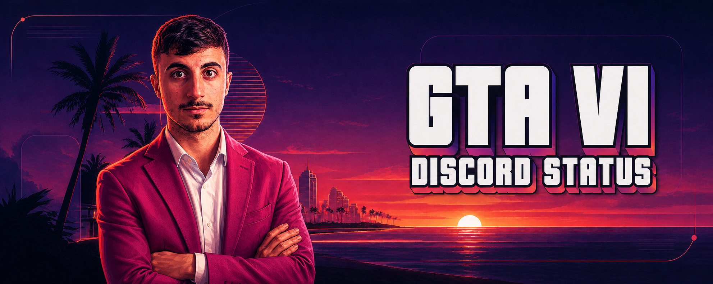

<p align="center">
  
</p>

<h1 align="center">GTA VI Discord Status Simulator</h1>

<p align="center">
  A polished Windows presence simulator with Discord game detection, realistic activity rotation,
  custom statuses, character selection, and saved profiles.
</p>

<p align="center">
  <a href="https://github.com/mamt104/gta6-discord-status-simulator/releases/latest"></a>
  <a href="https://github.com/mamt104/gta6-discord-status-simulator/blob/main/LICENSE"></a>
  
  
</p>

<p align="center">
  <a href="#quick-start">Quick start</a> ·
  <a href="#choose-your-mode">Modes</a> ·
  <a href="#build-from-source">Build</a> ·
  <a href="#troubleshooting">Troubleshooting</a> ·
  <a href="SECURITY.md">Security</a>
</p>

> [!IMPORTANT]
> This is an unofficial fan-made utility. It is not affiliated with, endorsed by, or sponsored by Rockstar Games, Take-Two Interactive, or Discord. It does not include GTA VI and is not evidence of access to a game build.

## What it does

The app can appear in Discord through normal executable detection or send a custom Rich Presence through your own Discord Application ID. It is designed for convincing presentation while keeping setup local, transparent, and reversible.

| Highlight | What you get |
| --- | --- |
| Natural Discord detection | Discord controls the game card, hover behavior, profile link, and recent activity |
| Session director | Ordered or manual activities with realistic timing |
| Flexible rotation | Variable timing or fixed 1, 3, 5, 10, 15, or 30-minute intervals |
| Character selection | Jason, Lucia, or combined play sessions |
| Clean startup | Optional five-minute period without a description |
| Personal control | Custom status text and an optional `Join` URL button |
| Persistent settings | Your selected mode and profile are restored on the next launch |
| Minimal access | No Bot Token, Client Secret, Discord password, or administrator rights required |

## Quick start

### 1. Download and extract

Download the latest package from [Releases](https://github.com/mamt104/gta6-discord-status-simulator/releases/latest), extract the entire ZIP, and keep all included files together.

### 2. Launch the fixed executable

Run `GTA6.exe`. Do not rename or move it after registration.

### 3. Register it in Discord

With the program still running:

1. Open **Discord → User Settings → Registered Games**.
2. Select **Add it!**.
3. Choose the running `GTA6.exe`.
4. Leave **Discord detection only** enabled in the app.

This registration step is required. Without it, Discord may display the wrong name or icon, skip recent activity, or treat renamed builds as different games.

> [!TIP]
> If you move the extracted folder later, remove the old Registered Games entry and add the executable again from its new path.

## Choose your mode

| | Discord detection only | Custom Rich Presence |
| --- | --- | --- |
| Best for | The most natural Discord game card | Custom scenes, state text, timer, and button |
| Setup | Add `GTA6.exe` to Registered Games | Create a Discord application and enter its Application ID |
| Card and icon | Managed by Discord | Managed by your Discord application and Art Assets |
| Recent activity | Controlled by Discord | Not guaranteed |
| Custom rotating details | No | Yes |
| Click and hover behavior | Controlled by Discord Game Profiles | Controlled by Discord Rich Presence |

**Discord detection only** starts automatically on every launch and sends no custom RPC payload. It is the recommended mode when the detected Game Profile is your priority.

**Custom Rich Presence** replaces the detected card. Discord can underline or make the complete `name + details + state` block clickable; the RPC protocol does not expose a setting that limits the clickable area to the game name.

## Custom Rich Presence setup

Skip this section if you only want Discord detection.

### Create your Discord application

1. Open the [Discord Developer Portal](https://discord.com/developers/applications).
2. Select **New Application** and choose a name.
3. Under **General Information**, copy the **Application ID**.
4. Do not use your Discord user ID; it is a different value.
5. You do not need to create a bot.

### Add an image asset

1. Open **Rich Presence → Art Assets** in your application.
2. Upload the included `assets/rich-presence-cover.png` file.
3. Assign the asset key `gtavi_cover` before saving it.
4. Save the asset and allow Discord a few minutes to update its cache.

Discord does not let you rename a saved asset key. Delete and upload the image again if the key is wrong. The included cover is unofficial fan artwork; see [assets/README.md](assets/README.md).

### Save the Application ID

From PowerShell in the project folder:

```powershell
powershell -ExecutionPolicy Bypass -File .\configure.ps1
```

To use a different image key:

```powershell
.\configure.ps1 -AssetKey "my_cover"
```

The script creates local configuration under `dist`. Application IDs are public identifiers, but Bot Tokens, Client Secrets, OAuth tokens, passwords, and webhooks must never be pasted into the app or committed.

## Build from source

Requirements:

- Windows 10 or Windows 11;
- Discord desktop running on the same computer;
- Microsoft .NET Framework 4.x.

Build with the C# compiler included in .NET Framework:

```powershell
powershell -ExecutionPolicy Bypass -File .\build.ps1
```

The fixed-name executable is written to `dist\GTA6.exe`. For a clean rebuild:

```powershell
powershell -ExecutionPolicy Bypass -File .\build.ps1 -Clean
```

Run it with:

```powershell
.\run.ps1
```

If you add an authorized square image as `assets\app-icon.png`, the build embeds it as the Windows executable icon.

## Troubleshooting

<details>
<summary><strong>Discord does not show the game</strong></summary>

- Confirm the Discord desktop app is open.
- Run `GTA6.exe` before opening Registered Games.
- Add the exact running executable with **Add it!**.
- Keep **Discord detection only** enabled.
- Remove stale entries for renamed or older builds.
- Restart Discord after changing the registered path.

</details>

<details>
<summary><strong>The whole text block is underlined on hover</strong></summary>

That is Discord's custom Rich Presence presentation. Re-enable **Discord detection only** for pure executable detection. The app cannot override Discord's clickable area.

</details>

<details>
<summary><strong>The Rich Presence image does not appear</strong></summary>

- Confirm that `dist\gta6-image.txt` exactly matches the Developer Portal asset key.
- Allow a few minutes for Discord's image cache to update.
- Fully quit and reopen Discord.
- Delete and re-upload the Art Asset if you previously tried to rename its key.

</details>

<details>
<summary><strong>Buttons do not appear on my own profile</strong></summary>

Discord may hide an activity's URL buttons from its owner. Check the presence from a second account or ask a friend.

</details>

## Privacy and security

This is a desktop app, not a Discord bot. It talks only to the local Discord client through Rich Presence IPC and does not collect account passwords. Read [SECURITY.md](SECURITY.md) before publishing a fork.

Application IDs and Public Keys are public identifiers. Bot Tokens and Client Secrets are private credentials and are never required by this project.

## Contributing

Issues and pull requests are welcome for reproducible bugs, UI improvements, documentation, and new activity sequences. Please keep submissions free of personal configuration and unlicensed artwork.

If the project helped you, starring the repository makes it easier for other people to discover it.

## License

Source code is available under the [MIT License](LICENSE). Third-party names, trademarks, and artwork remain the property of their respective owners. The repository hero is original project artwork and is not official game art.
